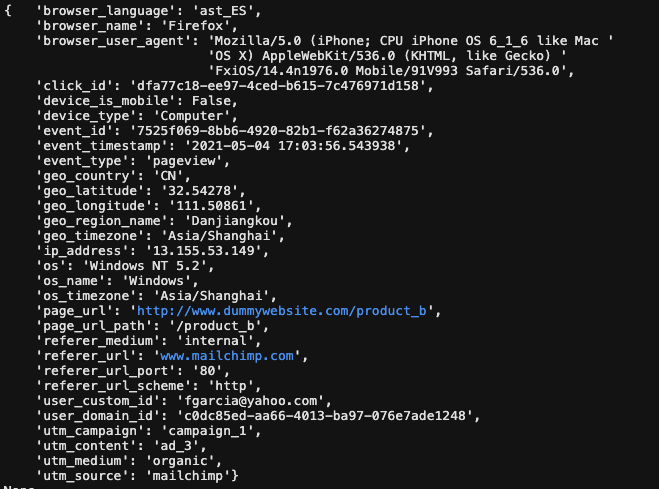

I have been wanting to explore streamed events post-ingestion. Tracking a customer's user behavior in real-time is extremely valuable because it allows you to see 
instant reponse to a new product feature or even intervene immediately when you see a customer possibly churn.

Though this is the standard data that comes into a company's system, testing a data pipeline's transformation and BI layer does not need code committed to 
Production. This is where mock event data comes in. In order to create some, I knew I had to find some online or create some on my own. And I ended up bumping into
this wonderful [post](https://towardsdatascience.com/simulating-web-events-7199bf8afcfd). 

The differentiator in this data was that random event data was created that simulated more real-life behavior probabilities. For example, the likelihood that a customer clicks on the Cart page, will not be the same likelihood that a customer click on Home page. A library called fake_web_events was used to generate the mock web events. Within the library, the Simulation function has user_pool_size and sessions_per_day arguments to define a certain population. Also, Simulation's run method allows you to define event time duration in seconds.

Here is a sample event:

And in order to load the data into my local Postgres database, sqlalchemy library was called. 
