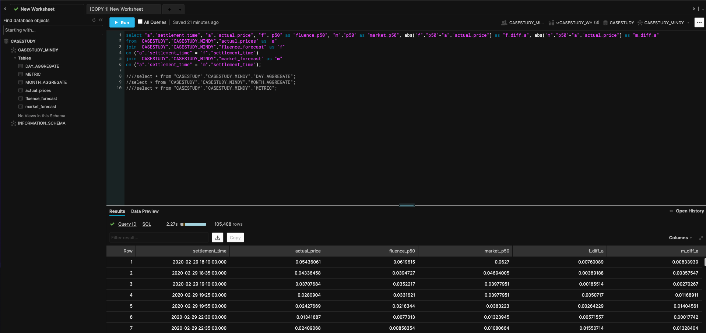

Full-stack analytics engineer is a critical member of the data org, talking to business stakeholders to help them take a pulse on the business. And through conversation
with them, understanding who/what are they trying to measure and why. Then translating that into a data question, reaching into the data warehouse grabbing the necessary 
data, transforming it to model business logic and presenting answer to business stakeholder's question with charts on a dashboard. 

For this project, I tackled a business question brought up in the Energy AI space. Fluence Digital is an AI company that creates software for economic optimization 
at the portfolio level. Energy price predictions are made and compared to competing market operators' predictions. The more accurate the prediction, the greater return on 
ROI for those in the energy market. That is why key question for Fluence Digital is how accurate are its predictive models?

A business stakeholder from Fluence would probably ask something on the lines of, "Whose forecast is better, ours or the market operators?" With this question, I was
given a year's worth of data on the actual price of energy ($/kWh), Fluence's predictions and Market Operators' predictions to answer the question. And everything had 
to be done in Python/SQL. The final deliverable would be a deployed web app with a link given to the stakeholder to see my analytic conclusion.

# [Extraction, Transformation and Load (ETL)](https://www.kaggle.com/mindyng/fluence-digital-etl)

My data was stored in a Snowflake instance. 

## Extraction

The tables had in common settlement_time and p50 prediction columns. I joined all tables on settlement_time using SQL which was written in [Kaggle](https://www.kaggle.com/) 
Notebooks, cloud computational environments that enables reproducible and collaborative analysis. I prefer using these notebooks since I can write Python and use
Kaggle's reliable computational power. I usually don't get Python package conflicts while using it and notebooks are pre-loaded with all data science libraries.
In order to pull the data programmatically from Snowflake environment into a Python one, there were three options: a custom Python script, Snowflake's Python Connector
or SQLAlchemy. I ended up using [SQLAlchemy](https://pypi.org/project/SQLAlchemy/) Python library because it required few lines of code to complete job I needed and produced no 
run errors upon execution. SQLAlchemy provides snowflake data table to be transformed into a Python object. In particular, the desired output would be a Pandas dataframe. This would allow 
transformations to the joined tables. 

## Transformation

In order to help answer the business question, a "better" metric had to be decided on in order to compare the two different forecasts. Given that these forecasts 
were time series forecasts, the usual measures are RMSE and MAE. RMSE is usually the metric of choice because when you are optimizing a forecast's lost function, 
you want to be able to quickly inspect where to optimize. And between RMSE and MAE, RMSE's loss function has a concave curve that makes it easier to detect where
to optimize. Also, RMSE penalizes error more (10 $/kWh from actual value is far greater than 5 $/kWh). A typical statistical library used to compute model performance
was used to create a metrics table. This table included prediction source (Fluence or market op's), horizon (365 days) rmse and mae values. 

From the base table, two columns were added: difference of Fluence predictions from actual price and the same for market op's predictions. I thought in order to
put the business stakeholder cap on, I had to think about how they would best understand how good a model would be besides a metric's results telling them. 
One way to understand data is to summarize it in pictures/visualizations. Conclusions on data can be made much better from graphs than straight numbers. This is why
I decided to calculate the difference columns. Last two tables made were daily and monthly aggregations of the table with the difference columns.

## Load

After creating the metrics table and updating the base data model with prediction differences from actual price values and aggregated versions of that table, I 
loaded these tables back into the Snowflake warehouse using SQLAlchemy's library again. 

# [Business Intelligence Visualization](https://www.kaggle.com/mindyng/fluence-digital-biz-viz)

In order to provide business stakeholder with interactive visualizations, I decided to go with the Plotly library since it has built-in interactivity. You can hover over
graphs for details, pan in and out, look at multiple hovers at once, etc. It allows the user to look at different angles of the data from one graph versus multiple snapshots 
of summarized data. I wanted to produce 4 different visualizations to help answer the business question: 

1. Forecast differences from Actual (Fluence vs. Market Operators)
2. Both forecasts against Actual prices
3. Montly aggregate of both forecasts against Actual prices
4. Daily aggregate of both forecasts against Actual prices

The first two graphs had some more interactive buttons in order to condense the time axis to day, month and 6 month level of data. Also, there was a range slider
in order to segment of window of time for viewing.

# Web Application Development and Deployment

The last step was to [create a web application](https://www.kaggle.com/mindyng/fluence-digital-app-and-deployment/) that could be deployed so the business stakeholder could get a link to interact with graphs, see data and read the data 
story to understand how the analytic conclusion was made. And this would add to their own take on the data and tell a story of their own. In order to develop my web app,
it was between Plotly Dash and Heroku or Plotly graphs and Streamlit. I went with the second option because I was already familiar with Streamlit and it has a 
huge number of Github contributors. So app development was straight forward and code was light.

For [deployment](https://share.streamlit.io/mindyng/2021-projects/main/fluence_digital/streamlit_deploy.py), that was even simpler because all I had to do was request an invite to Streamlit Sharing capabilities. Then all I had to do was provide my Github repo 
that included my app Python script and requirements.txt to specify packages needed to build the app and everything else was done by Streamlit. And within a minute
or two my app was deployed on the web with a URL I shared with my business stakeholder.

# Conclusion

The metrics table showed the predictions with the lowest RMSE and MAE was Fluence's forecast. And visualizations showed that Fluence's difference from actual 
price values had most values closest to 0 and its affinity to the actual price graph was greater when graphed against that and market operators' forecast. Thus, 
Fluence forecasts were better!

Some concluding thoughts on implementation, good to have multiple options when implementing whether it be for the ETL, visualization or development and delployment 
step. The best tools to answer the business stakeholders best were the tools I chose. At the same time, in a business context, especially at a start-up, when
you need to factor in maintainability and time to deliver, the best solution may be second best. However, the job got done!

