## Business Problem:

When it comes to ETA for a service, how long an order takes to arrive at a customer's location is a huge factor in whether or not a customer will choose to order or even come back
as a customer (retention). If the time it takes to deliver is earlier than predicted time then that will sometimes not harm the brand-customer relationship. However, if a package/goods is delivered 
later than the predicted time then customers will be unstatisfied and most likely will churn and seek a competitor for delivery services.

## Metric(s) To Lift:

1. Conversion - Direct
2. Customer Satisfaction (NPS), e.g. less Customer Support tickets / Retention - Stretch

## Hypothesis:

When providing an accurate delivery time prediction, customers are more willing to order/come back to the platform and have less complaints.

## Analysis/Approach:

### Tech Stack:
1. [DuckDB](https://duckdb.org/docs/guides/python/jupyter.html) for database/data engineering within Python notebook 😀
2. [Kaggle Jupyter Notebooks](https://www.kaggle.com/docs/notebooks) for analysis and notes
3. [Pycaret](https://pycaret.gitbook.io/docs/) for AutoML 😲


The task is to predict the delivery time (in seconds) using a dataset that has all the same predictors as the training dataset except for the target variable: delivery time.

The predictors/independent variables were:

* market_id
* store_id
* store_primary_category
* order_protocol
* total_items
* subtotal
* num_distinct_items
* min_item_price
* max_item_price
* total_onshift_dashers
* total_busy_dashers
* total_outstanding_orders
* estimated_order_place_duration
* estimated_store_to_consumer_driving_duration

Only difference between the dataset given to train the model and the dataset used to predict delivery time were delivery time was not in it and an extra feature called platform had
to be taken out.

In order to dig into the problem, first calculated the target variable by calculating the difference between order creation time and time when order delivered to customer.

Did some feature engineering in order to create possible strong predictors for delivery time.

```
# breaking up order creation into different data components

def extract_date_features(data):
    data['created_at'] = pd.to_datetime(data['created_at']) 
    
    data['hour'] = data['created_at'].dt.hour
    data["day"] = data['created_at'].dt.day
    data['day_of_week'] = data['created_at'].dt.day_of_week.astype(int)
    data['is_weekend'] = np.where(data['day_of_week'].isin([5, 6]), 1, 0)
    data["month"] = data['created_at'].dt.month
    data["quarter"] = data['created_at'].dt.quarter
    data["is_month_start"] = data['created_at'].dt.is_month_start.astype(int)
    data["is_month_end"] = data['created_at'].dt.is_month_end.astype(int)
    data["is_quarter_start"] = data['created_at'].dt.is_quarter_start.astype(int)
    data["is_quarter_end"] = data['created_at'].dt.is_quarter_end.astype(int)
#     data["year"] = data['created_at'].dt.year
#     data["is_year_start"] = data['created_at'].dt.is_year_start.astype(int)
#     data["is_year_end"] = data['created_at'].dt.is_year_end.astype(int)
extract_date_features(data)
data.head()
```

Then went into univariate and bivariate analyses. 

Univariate analysis could have been isolated to the target variable, but I wanted to see the distribution of each variable in order to see the distribution and detect
outliers that needed to be excluded. 

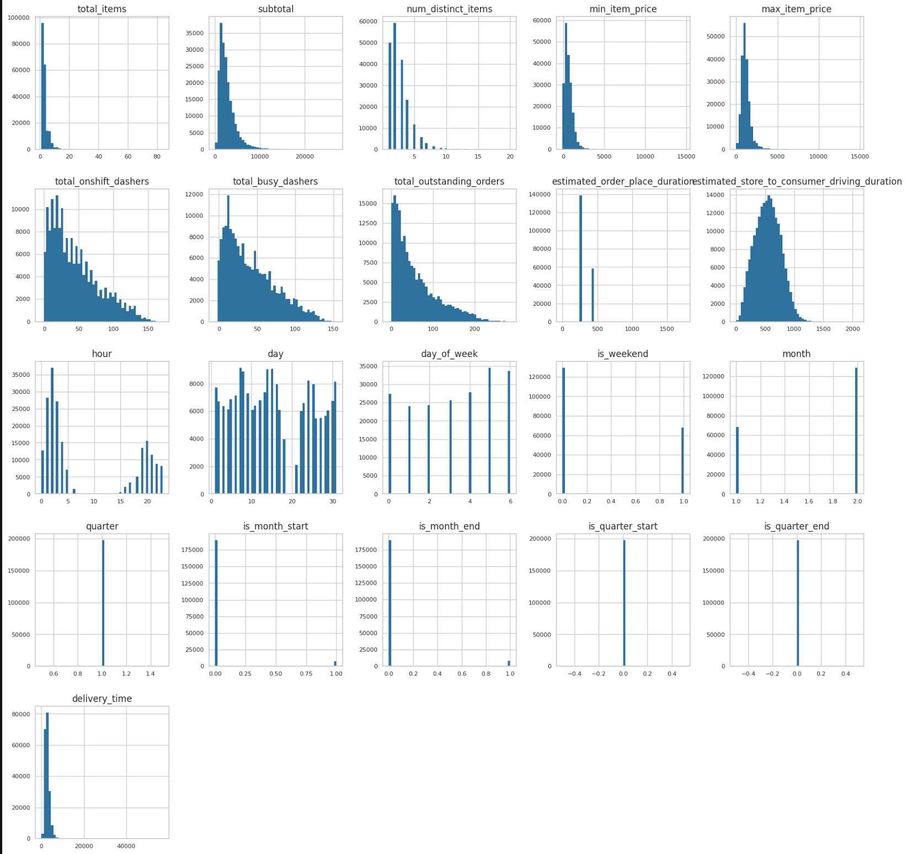

For bivariate analysis, the focus was on which of the independent variables mostly affected the dependent/target variable even though there were other comparisons calculated.
The first picture shows numerical features against delivery time. Second bivariate comparison is with sample of the data to give a rough, but more clearer picture of correlation strength.

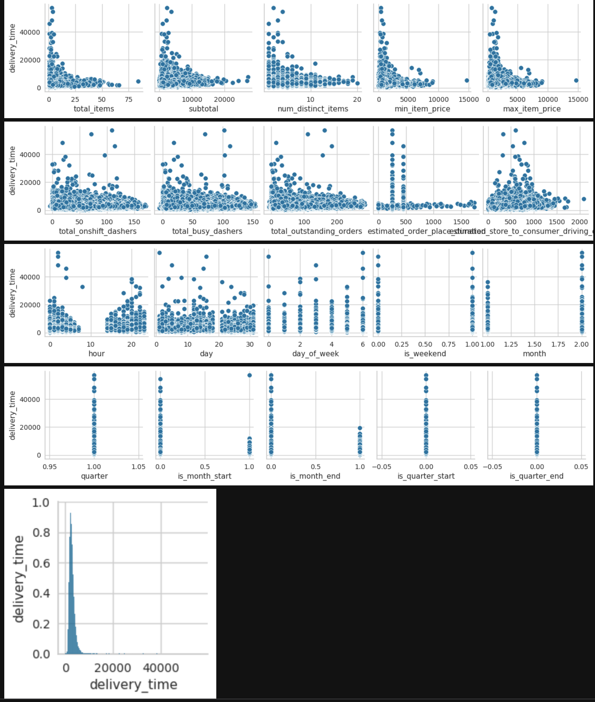
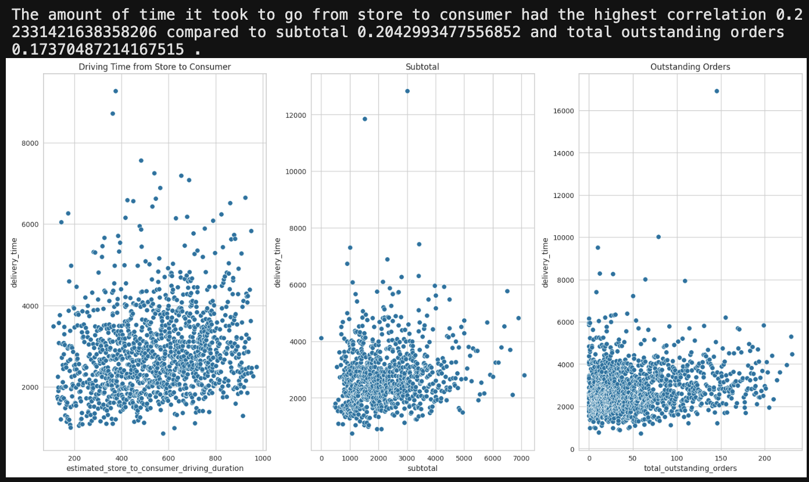

Remaining bivariate comparisons are most, but not all categorical variables versus delivery time.

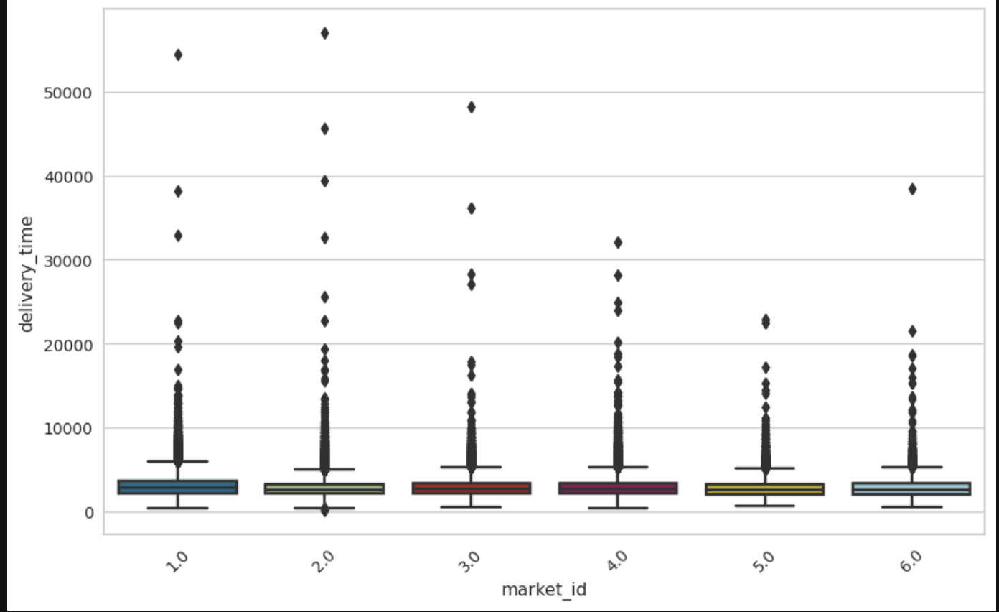
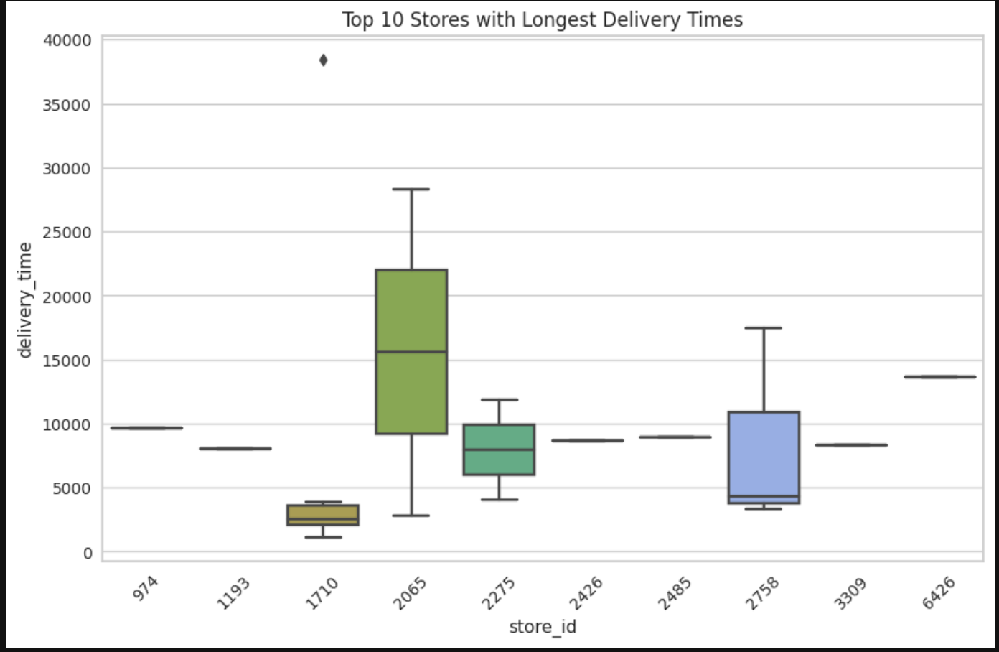
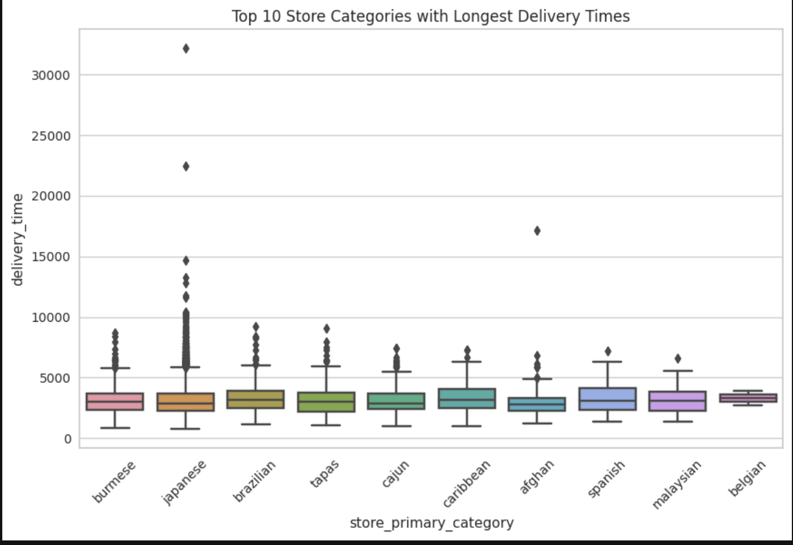

Multivariate analysis was limited since we wanted to quickly see any possible correlations between features and delivery time.

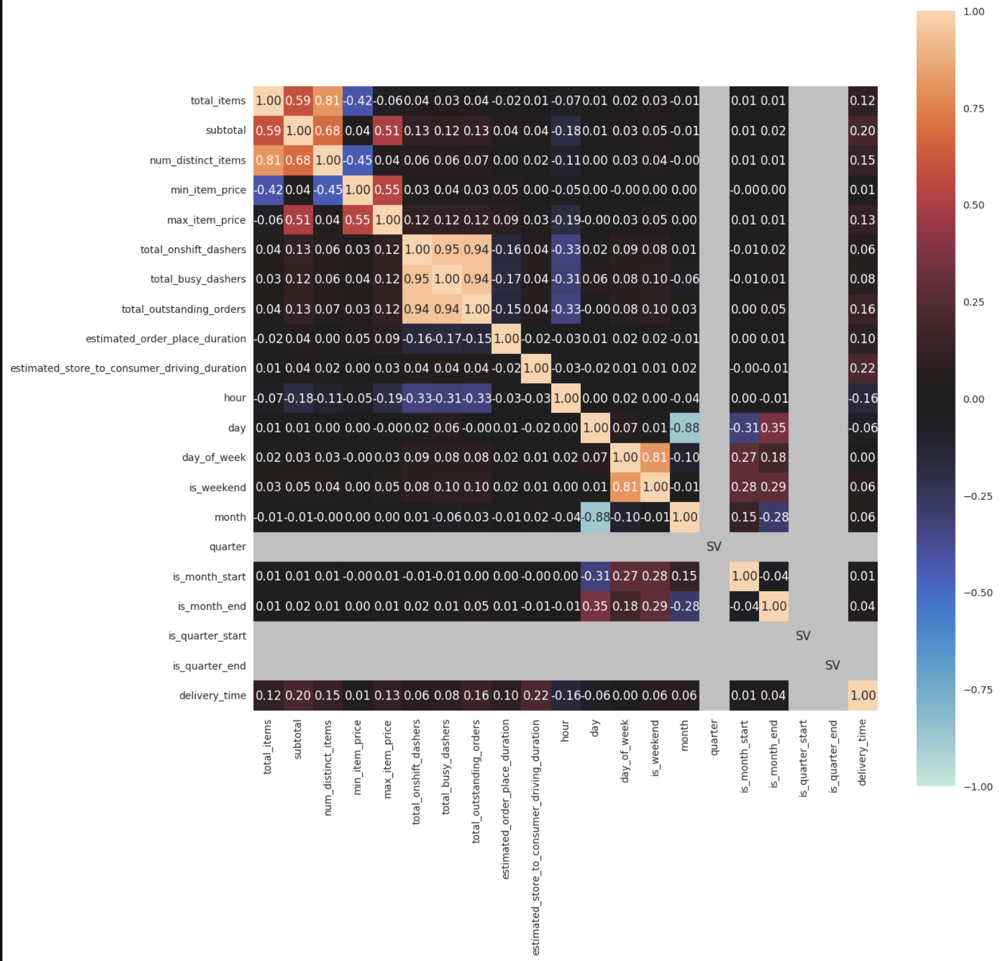

This initial exploratory analysis gave us a look at the quality of the data (outliers) along with any possible correlations there could be with delivery time. Before doing exploratory data analysis, it would make sense that some possible strong indicators of delivery time would be number of items ordered, geographic distance of store to customer, experience of courier, weather conditions. Our dataset did not have all these variables, except total items.

Some markets did have longer delivery times, meaning they may have been geograpically more spread out, had higher traffic areas, more inexperienced dashers, restaurants that were slower in output, etc. Also, there was a store that took significantly longer than all the rest of the stores in the dataset with a lot of variance as well. Japanese cuisine for some reason has the highest variance when it came to delivery time. This may be due to a variety of restaurants serving Japanese food that are more efficient than others/variety of prep times within Japanese cuisine. 

According to metric used to grade numerical-numerical correlations, delivery time had mostly strong correlations.

Cramer's V Score Thresholds:

* weak: >0.05; moderate: >0.10; strong: >0.15; and very strong: >0.25.
* strong: estimated_store_to_consumer_driving_duration, subtotal, num_distinct_items, total_outstanding_orders
* moderate: max_item_price

From here, able to prepare data to feed into AutoML algorithms including properly imputing few NaN values in target variable.

Only from feeding the data into our AutoML did we discover the most influential factors to predict delivery time.

## Insights:

In order to choose an appropriate ML model, instead of choosing a couple and spending time fine-tuning them to get the best one based on appropriate performance metric, ended up using open source AutoML to compare 20 different models at once. Though the process was automated, there was some manual work done such as with pre-processing the data used to train models (except for one-hot encoding). Pycaret had some functions  Best model was chosen based on a Linear Regression performance metric called RMSE. Then it was fine-tuned to see if other versions of original best model perform better. Original best model remained superior. From this, the most important contributors to delivery time were determined. And finally, these were graphed against delivery time. The graphs are using the whole dataset (not sample). Therefore, interpreting positive/negative/no correlation is challenging. Hence, would refer to Feature Importance Plot over bivariate correlation graphs.

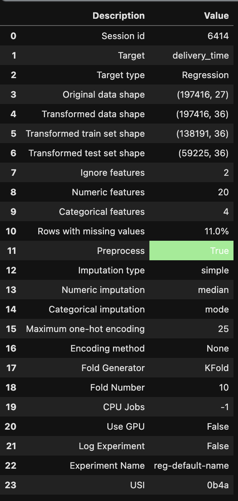

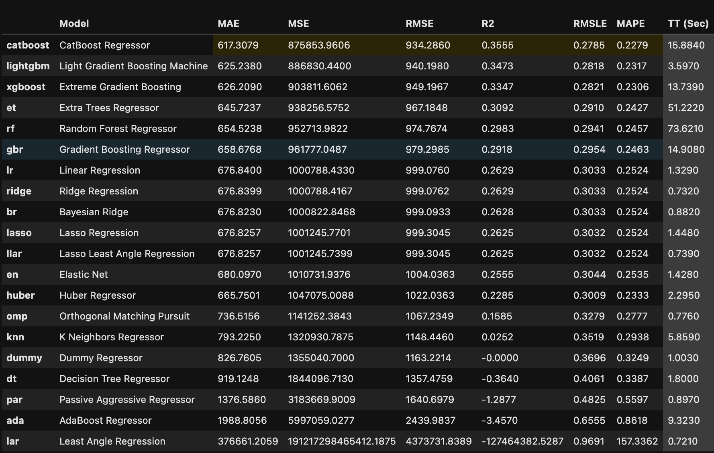
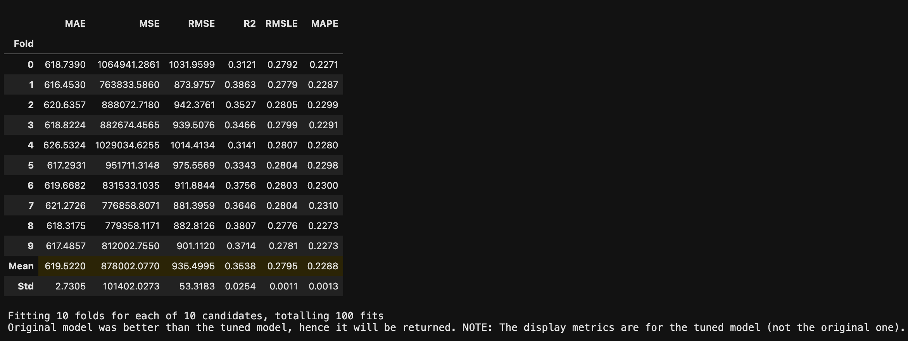
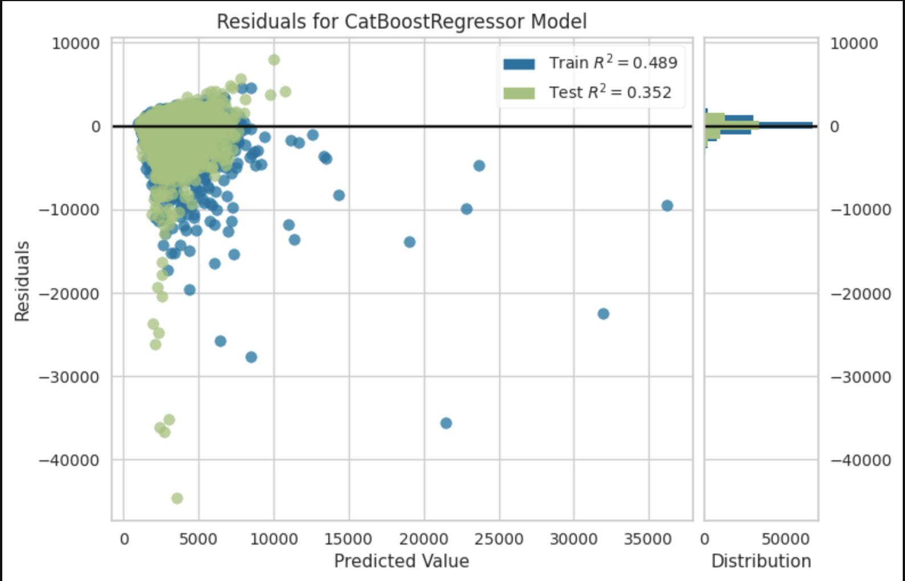
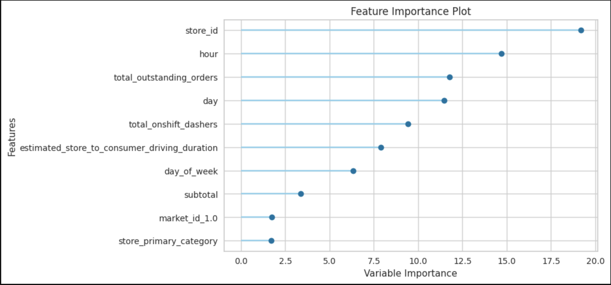
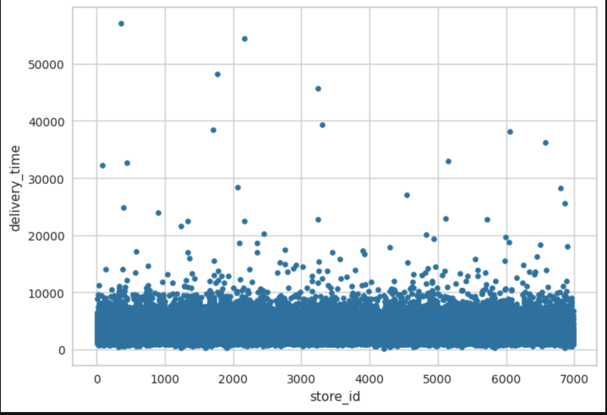
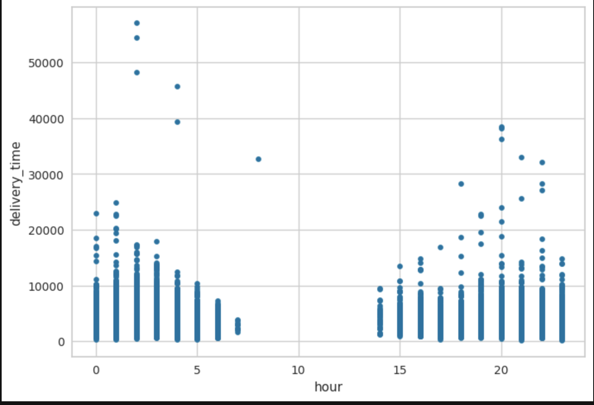
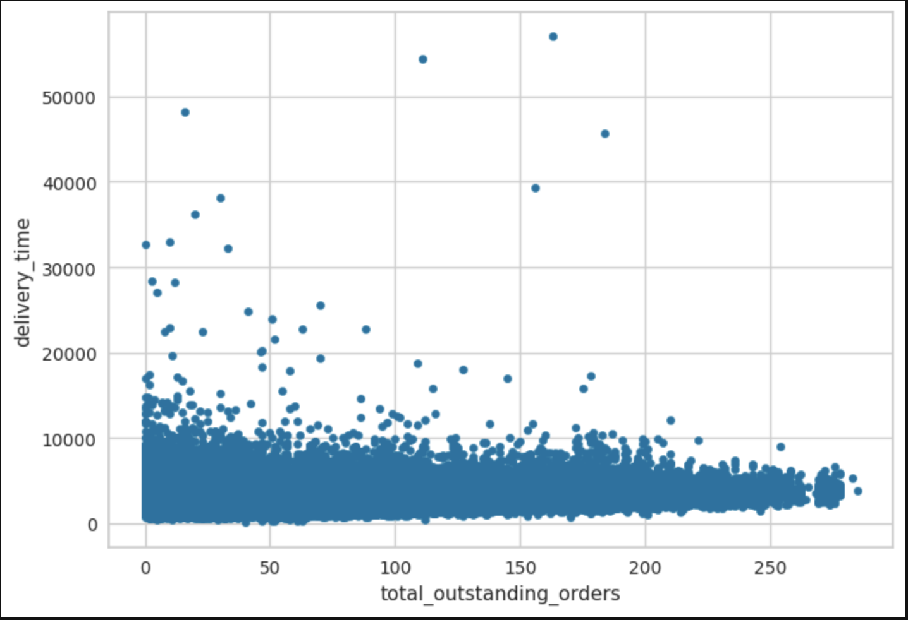

Final chosen model from Pycaret package used to make [predictions](https://github.com/mindyng/2023-Business-Projects/blob/main/Food_Delivery/delivery_time_predictions.csv) on given test set, which had to be cleaned up by making sure columns were exactly like original dataset fed into setup() for training. Main data engineering needed besided aligning columns with training dataset was to take care of the string null's as shown below. 

```
# Imput string 'NA', not Null's...

query = """
select total_items
, estimated_order_place_duration
, store_id
, max_item_price
, num_distinct_items
, min_item_price
, subtotal
, hour
, day
, day_of_week
, is_weekend
, month
, quarter
, is_month_start
, is_month_end
, is_quarter_start
, is_quarter_end
, if(total_outstanding_orders = 'NA', 33, total_outstanding_orders) as total_outstanding_orders
, if(total_onshift_dashers = 'NA', 4, total_onshift_dashers) as total_onshift_dashers
, if(total_busy_dashers = 'NA', 41, total_busy_dashers) as total_busy_dashers
, if(store_primary_category = 'NA', 'american', store_primary_category) as store_primary_category
, if(order_protocol = 'NA', 1, order_protocol) as order_protocol
, if(market_id = 'NA', 2, market_id) as market_id
, if(estimated_store_to_consumer_driving_duration = 'NA', 535, estimated_store_to_consumer_driving_duration) as estimated_store_to_consumer_driving_duration
from df2
"""

df2 = duckdb.query(query).df()
df2
```

## Business Recommendation/Impact for Growth:

Given that the store, hour and total outstanding orders were the top 3 important contributors to delivery time prediction, would focus on particular vendors' turn around time or even drop vendors that are not helping with providing SLA with respect to delivery time. When an order is placed is crucial as well as high order times such as around meal times would impact delivery time predictions because there can be a huge lag when there are a lot of orders in the queue versus when orders are placed in between meal times. Last, total outstanding orders need to be monitored because if there are too many then business needs to help balance the supply side of the market. Some examples for this is by handing out incentives for dashers who take on more orders/deliver faster.

[Code](https://github.com/mindyng/2023-Business-Projects/blob/main/Food_Delivery/doordash-delivery-time-prediction.ipynb)
